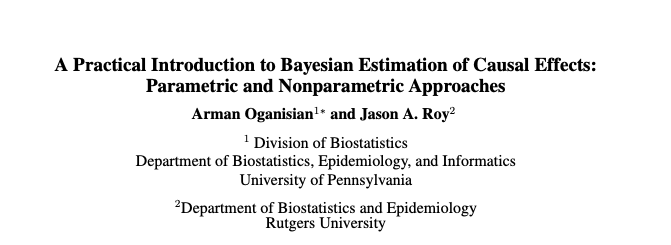
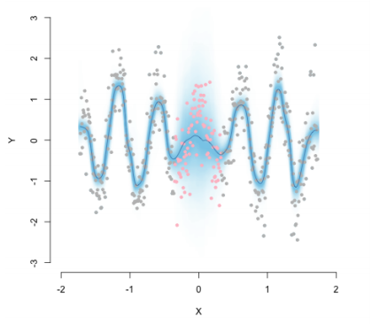

## Paper on arXiv

---
## Paper on arXiv

---

## Causal inference

Typical Causal Questions:

- What would have happened in the target population had everyone:
  - e.g. enrolled in an unemployment assistance program?
  - e.g. gotten vaccinated?
  - e.g. been treated with drug A instead of B?
  
--

- Suppose I have selection bias:
  - How uncertain should I be about my effect estimate?
  - How much selection bias would be needed to reverse my results?
  
--

- Requires assumptions:
  - Identification assumptions.
  - (often) Modeling/statistical assumptions.

---
## Some notation

What do we observe?
- Data: $\{Y_i, A_i, L_i \}_{1:n}$
- Binary exposure: $A_i \in \{0,1\}$. 
- Vector of Confounders: $L_i, \in \mathcal L$. 
  - e.g. $L_i =(L_{1i}, L_{2i} )$.
  - $\mathcal{L} = \{0,1\} \times \{ \mathbb{R} \}$
- Scalar (observed!) outcome: $Y_i \in \mathcal{Y}$ 
- Scalar (potential!) outcome: $Y^a \in \mathcal{Y}$

---

## Some notation

What do we want?

- Average treatment effect (ATE):
$$ \Psi = ATE = E[Y^1 - Y^0]$$

--

- Conditional ATE (CATE):
$$ \Psi_V = CATE = E[Y^1 - Y^0 \mid V]$$

---

## Causal modeling 
CATE can be identified as 
\begin{equation}
  E[Y^a \mid V=v  ] = \int_{\mathcal{L}} E[ Y \mid A=a, L, V=v] P(L) dL
\end{equation}

- Known as "standardization".
- Requires model for $E[ Y \mid A=a, L, V=v]$.
- Most of the time requires model for  $P(L)$.

---
## Bayesian estimation

Bayesian approaches can help:
- Priors on $E[Y\mid A, L, V]$.
- Degrees of belief in causal assumptions. 
- Suite of nonparametric tools (with uncertainty estimation).

---

## Bayesian Modeling 
Suppose $v=0,1, 2, 3, 4$ (e.g. race groups).

$$Y \mid A, L, V, \bar{\beta}, \bar{\theta} = N \Big ( \beta_0 +\beta_1'L + (\theta + \theta_v)A \Big)$$

--

$$\begin{align}
  E[Y^a \mid V=v  ] & = \int_{\mathcal{L}} E[ Y \mid A=a, L, V=v] P(L) dL \\
                    & = \int_{\mathcal{L}} \Big\{ \beta_0 +\beta_1'L + (\theta + \theta_v)a \Big\} \ P(L) dL \\
                    & = \beta_0 + (\theta + \theta_v)a + \int_{\mathcal{L}} \beta_1'L \ P(L) dL
\end{align}$$

--

Implies 
$$\Psi_v = E[Y^a \mid V=v] = \theta + \theta_v$$

---

## Priors for $\Psi_v$

